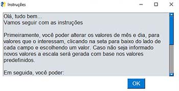
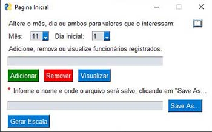
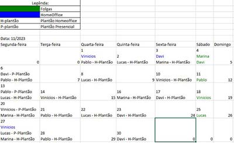

# Projeto_Escala_Folgas
<p align="justify">Este programa Python permite aos usuários gerar uma escala de trabalho com base em dados de funcionários e dias do mês. Ele oferece uma interface gráfica simples para adicionar, remover e visualizar funcionários, bem como para gerar uma escala de trabalho em um arquivo Excel.</p>

## Principais Funcionalidades:

- ✅ Adiciona um funcionário à lista de funcionários.
- ❌ Remove um funcionário da lista.
- 📋 Exibe a lista de funcionários registrados.
- 📅 Gera uma escala de trabalho com base nos dados fornecidos.

## 🛠️ Tecnologias Utilizadas
Principal tecnologia usada:</br>
**[Openpyxl](https://openpyxl.readthedocs.io/en/stable/index.html)**</br>
**[PysimpleGUI](https://www.pysimplegui.org/en/latest/)**</br>

## Licença
Este projeto é licenciado sob a licença MIT. Consulte o arquivo [LICENSE](LICENSE) para obter detalhes.

## 🚀 Instruções de Uso
### 👨‍💻 Crie um ambiente virtual
Para criar o ambiente virtual execute o seguinte código no terminal, substituindo o nome pelo seu nome ou outra palavra de sua preferência:
```bash
pip python -m venv nome
```
### 👨‍💻 Ative o ambiente vitual
Para ativar o ambiente virtual, execute o seguinte código no terminal, o nome aqui é mesmo que você definiu no passo anterior:
```bash
nome/scripts/activate
```
### 👨‍💻 Instalale as dependências
Para instalar as dependências do projeto, execute o seguinte comando no terminal:
```bash
pip install -r requirements.txt
```
### ✨ Execução do Programa:
Execute o programa a partir do arquivo principal, mas não esqueça de realizar os passos anteriores.
```bash
python app.py
```
#### Interface
<p>Janela de instruções, com os passos para lidar com a interface do programa.</p>



<p>Janela Principal, onde é possível seguindo os passos da instrução gerar uma escala de trabalho genérica ou específica para sua necessidade.</p>



<p>Exemplo de arquivo que será gerado apartir da execução do peograma.</p>



#### Observação
<p>Durante o uso do programa, para visualizar a janela de instruções novamente, basta clicar no botão livro no canto superior direito da tela.</p>
<p>A escala de trabalho gerada seguira critérios de trabalho predefinidos, sendo possível alterar somente o mês, dia que irá iniciar a escala e os funcionários que estarão na mesma.</p>